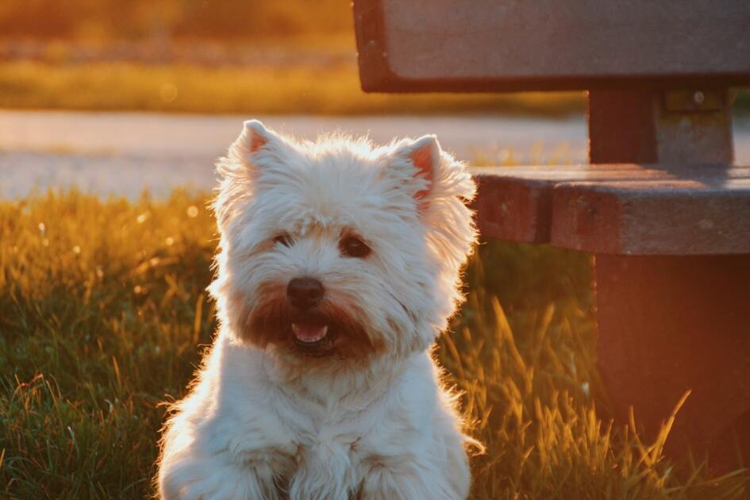
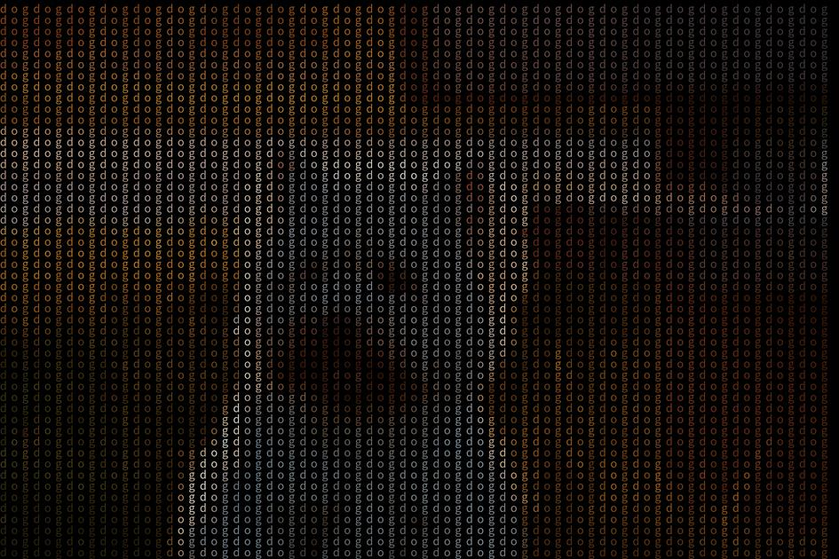

# Image-Fill

A simple program that replaces the original pixels of a picture with something else

## Prerequisites

### Dependencies

Python interpreter and package Pillow.

#### Install `Pillow`

```bash
pip install Pillow
```

## Run

```bash
python porg.py image
```

## Usage

~~~
usage: image_textify.py [-h] [--lines LINES] [--text TEXT] [--gray GRAY]
                        [--output OUTPUT] [--font FONT]
                        input

A simple program that replaces the original pixels of a picture with text

positional arguments:
  input                 input file

optional arguments:
  -h, --help            show this help message and exit
  --lines LINES, -l LINES
                        text lines will on the image, default: 50
  --text TEXT, -t TEXT  text will be drawn on the image, default: text
  --gray GRAY, -g GRAY  whether to output grayscale image, default: False
  --output OUTPUT, -o OUTPUT
                        output file path, default: ./a.extension
  --font FONT, -f FONT  specify the font to use, if the default font is not
                        displayed
~~~

## Result

[Test image source](https://unsplash.com/photos/sirEpWjfSmo)

Original image:

    
Textify:


Image on image:

    
## Note

Because I want to use CJK text, 
I have set a font that supports CJK text Under the font directory.

You could specify the font to use, if the default font is not displayed

## TODO

- [ ] image on image command line parser
- [ ] combine two programs

    
## License

Though it is so tiny and may not good, it still has a licence.

The project is released under the MIT License.

## Off topic

I don't know much about Python, so the code may not be very good.

At the same time, I am not sure whether the use of Noto font is infringing.
If so, please let me know and I will delete it.