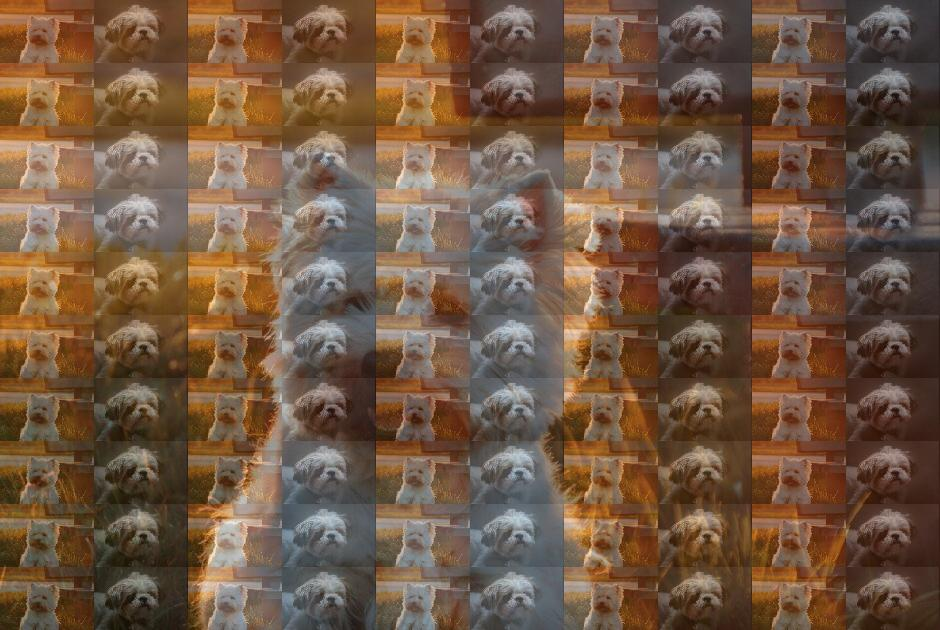

# Image-Fill

A simple program that replaces the original pixels of a picture with other things

## Prerequisites

### Dependencies

Python interpreter and package Pillow.

#### Install `Pillow`

```bash
pip install Pillow
```

## Run

```bash
python porg.py image
```

## Usage

~~~
python fiot.py -h
~~~

## Result

[Test image source](https://unsplash.com/photos/sirEpWjfSmo)

- Original image:

    
- Image filled with text (50x50):


- Image filled with itself (20x20):


Image filled with other image (10x10):


Image filled with images include itself (10x10):

    
## Note

Because I want to use CJK text, 
I have set a font that supports CJK text Under the font directory.

You could specify the font to use, if the default font is not displayed

## TODO

- [ ] image on image command line parser
- [ ] combine two programs

    
## License

Though it is so tiny and may not good, it still has a licence.

The project is released under the MIT License.

## Off topic

I don't know much about Python, so the code may not be very good.

At the same time, I am not sure whether the use of Noto font is infringing.
If so, please let me know and I will delete it.